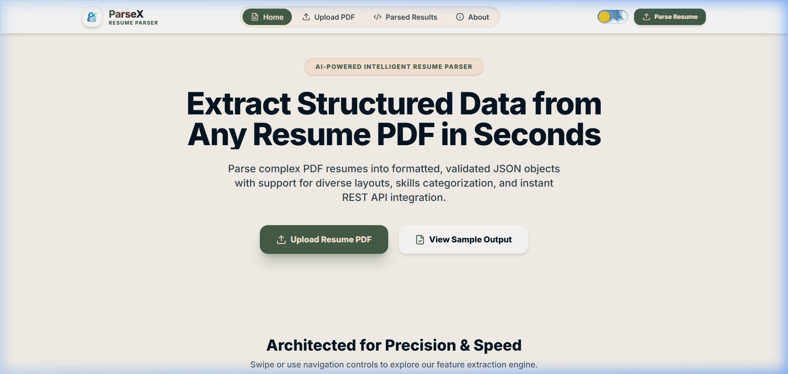
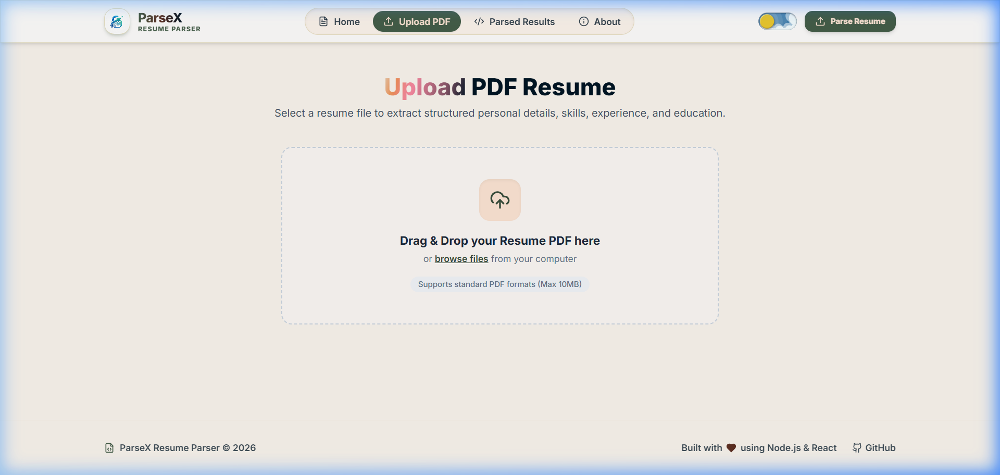
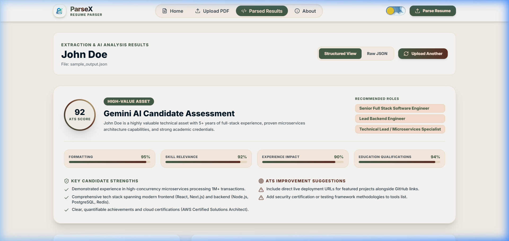
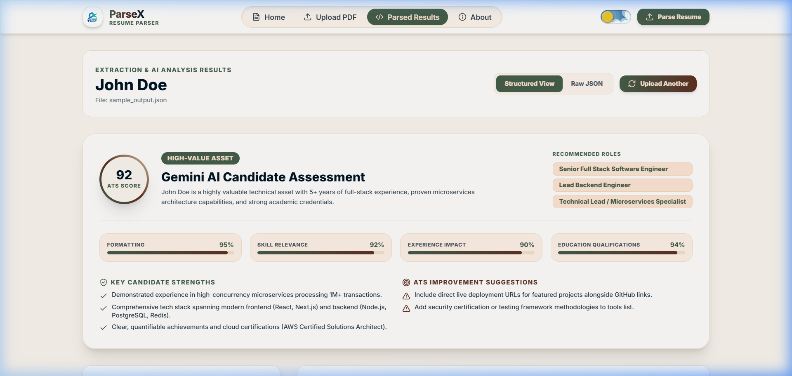
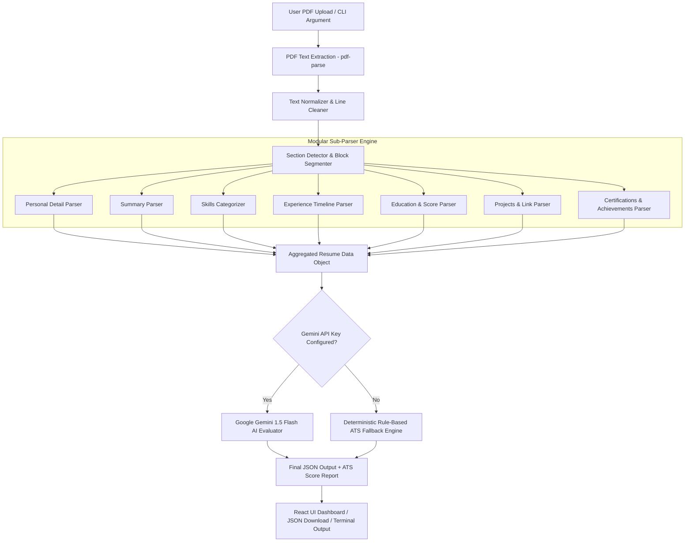

# ParseX - Enterprise PDF Resume Parser & AI ATS Analyzer

[](https://nodejs.org)
[](https://react.dev)
[](https://vitejs.dev)
[](https://tailwindcss.com)
[](https://deepmind.google/technologies/gemini/)
[](https://jestjs.io)
[](https://opensource.org/licenses/MIT)

**ParseX** is an enterprise-grade, modular Node.js & React web application and CLI tool that extracts structured information from PDF resumes using regex rule matching, heuristic text segmentation algorithms, and **Google Gemini 1.5 Flash AI** candidate scoring.

---

## 📸 Application Screenshots & Visual Tour

### 1. Landing Dashboard & Feature Overview


### 2. Drag & Drop PDF Upload Interface


### 3. Structured Data Results & Gemini AI Assessment


### 4. Sleek Dark Mode Experience


---

## 📌 Project Overview

**ParseX** accepts PDF resumes with complex multi-column section layouts, converting unformatted PDF text streams into clean, validated, and normalized JSON objects. 

### Dual Operational Modes
1. **Full-Stack Web Dashboard & REST API**: Interactive React 19 + Vite dashboard featuring drag-and-drop PDF uploads, live progress tracking, structured section cards, AI ATS scoring breakdown, copy/download utilities, and dark mode.
2. **CLI Engine Runner**: Fast terminal parsing via `node resume-parser.js sample_resume_1.pdf` for batch scripting or backend integrations.

---

## ✨ Key Features & Capabilities

- 🤖 **Google Gemini 1.5 Flash AI Scoring**: Calculates an automated ATS compatibility score (0-100), key strengths, areas for improvement, and recommended hiring roles.
- 🛡️ **Rule-Based Fallback Engine**: If no AI API key is configured, ParseX executes a zero-dependency deterministic rule engine to ensure 100% uptime.
- 🔍 **Automated Section Classification**: Uses regex header matching and line proximity heuristics to segment sections (*Experience*, *Education*, *Skills*, *Projects*, *Certifications*, *Achievements*, *Summary*).
- 👤 **Personal Detail Extraction**: Extracts candidate full name, email, phone number, LinkedIn URL, GitHub URL, portfolio links, and geographical location.
- ⚡ **Categorized Skill Classifier**: Groups technical skills into `Languages`, `Frameworks`, `Libraries`, `Databases`, and `Tools`.
- 💼 **Work History Timeline**: Captures company names, job titles, durations (e.g. `Jan 2023 - Present`), locations, and bullet point responsibilities.
- 🎓 **Academic Credential Parser**: Extracts degree type, university/college name, CGPA / percentage scores, and start/end years.
- 🚀 **Projects & Repo Extraction**: Extracts project titles, detailed summaries, tech stacks used, and live demo / GitHub repository links.
- 🌙 **Modern Glassmorphism UI**: High-contrast, responsive light & dark theme built with React, Vite, and Tailwind CSS.

---

## 🏗️ System Architecture & Data Flow



---

## 🛠️ Tech Stack & Dependencies

### Backend Stack
| Technology | Description |
| :--- | :--- |
| **Node.js (v18 / v22 LTS)** | Asynchronous JavaScript Runtime |
| **Express.js (v4.19)** | RESTful API HTTP Server |
| **Google Generative AI SDK** | Gemini 1.5 Flash Integration for ATS scoring |
| **pdf-parse (v1.1)** | Fast server-side PDF stream buffer parsing |
| **Multer (v1.4)** | Multipart form-data file upload handler |
| **Jest (v29.7)** | Unit testing framework for sub-parsers and pipeline |

### Frontend Stack
| Technology | Description |
| :--- | :--- |
| **React 19 / Vite 5** | High-performance Single Page Application (SPA) |
| **Tailwind CSS 3.4** | Custom utility styling with dark mode context |
| **Lucide Icons** | Modern UI vector icons |
| **Axios** | Client-side API request handler |

---

## 📂 Project Structure

```
ParseX/
├── package.json                   # Root package configuration & npm scripts
├── resume-parser.js               # CLI Entry point (node resume-parser.js <file.pdf>)
├── jest.config.js                 # Jest unit test configuration
├── sample_output.json             # Reference output JSON schema
├── sample_resume_1.pdf            # Sample resume 1 (Software Engineer)
├── sample_resume_2.pdf            # Sample resume 2 (Backend & Cloud Lead)
├── README.md                      # Project documentation
├── .env                           # Environment variables (GEMINI_API_KEY, PORT)
│
├── docs/
│   └── images/                    # UI Screenshots for documentation
│       ├── home_page.png
│       ├── upload_page.png
│       ├── results_page.png
│       └── dark_mode_results.png
│
├── scripts/
│   └── generate_sample_pdfs.js    # PDFKit script to generate sample test PDFs
│
├── server/                        # Express Backend Engine & Parsers
│   ├── server.js                  # Express server listener
│   ├── config/                    # Server configuration settings
│   ├── controllers/               # Express request handlers (parserController.js)
│   ├── middlewares/               # Multer upload & file validation rules
│   ├── routes/                    # API routes (/api/parser/...)
│   ├── services/                  # Core Business Logic & Orchestration
│   │   ├── resumeParserPipeline.js # Main multi-step parsing orchestrator
│   │   └── aiAssessmentService.js  # Gemini 1.5 Flash & Fallback ATS Engine
│   │
│   ├── parsers/                   # Modular Sub-Parser Extraction Modules
│   │   ├── sectionDetector.js     # Header classifier & block segmentation
│   │   ├── personalParser.js      # Name, email, phone, social links, location
│   │   ├── summaryParser.js       # Executive summary / about text extraction
│   │   ├── skillsParser.js        # Categorized skills matcher
│   │   ├── experienceParser.js    # Work experience entries & bullet extractor
│   │   ├── educationParser.js     # Degree, institution, dates & CGPA scores
│   │   ├── projectsParser.js      # Project names, descriptions & repo links
│   │   ├── certificationsParser.js# Certifications list
│   │   └── achievementsParser.js  # Hackathons, honors & awards
│   │
│   ├── utils/                     # Regex expressions & text cleaning utilities
│   │   ├── regexHelpers.js
│   │   └── textUtils.js
│   └── tests/                     # Jest unit test suite
│
└── client/                        # React + Vite + Tailwind CSS Frontend
    ├── index.html
    ├── vite.config.js
    ├── tailwind.config.js
    └── src/
        ├── components/            # Header, FileUploader, SectionCards, ScoreBadge
        ├── context/               # ThemeContext (Dark/Light mode switch)
        ├── pages/                 # Home, Upload, Result, About, NotFound
        ├── services/              # Axios API service integrations
        └── App.jsx
```

---

## 🚀 Setup & Installation Instructions

### Prerequisites
- **Node.js**: `v18.0.0` or higher (`v22 LTS` recommended)
- **npm**: `v9.0.0` or higher

### 1. Clone & Install Dependencies

```bash
# Clone the repository
git clone https://github.com/your-username/ParseX.git
cd ParseX

# Install root & backend dependencies
npm install

# Install frontend client dependencies
cd client
npm install
cd ..
```

### 2. Configure Environment Variables

Create a `.env` file in the root directory:

```env
PORT=5000
NODE_ENV=development
# Optional: Set your Google Gemini API key for AI ATS candidate evaluations
GEMINI_API_KEY=YOUR_GEMINI_API_KEY
```

### 3. Build Sample Test PDFs (Optional)

Regenerate sample resume PDF documents in the project root:

```bash
npm run build:sample-pdfs
```

---

## 💻 Usage & Execution

### Option A: Command Line Interface (CLI)

Run direct terminal parsing on any local PDF file:

```bash
node resume-parser.js sample_resume_1.pdf
```

Or using npm script shortcut:

```bash
npm start sample_resume_2.pdf
```

*The extracted JSON results will be printed to stdout and saved in `server/output/`.*

---

### Option B: Full-Stack Web Application

Launch both Express Backend (`http://localhost:5000`) and React Frontend (`http://localhost:5173`) concurrently:

```bash
npm run dev
```

Open your browser and navigate to: **`http://localhost:5173`**

To run services individually:
- Backend Server: `npm run server`
- React Frontend: `npm run client`

---

## 🧪 Unit Testing

Execute the complete Jest test suite covering regex pattern matchers, sub-parsers, section detection, and end-to-end pipeline execution:

```bash
npm test
```

---

## 🌐 REST API Reference

### 1. Upload & Parse PDF Resume
- **Endpoint**: `POST /api/parser/upload`
- **Header**: `Content-Type: multipart/form-data`
- **Body**: `resume` (PDF binary file)
- **Response**:
```json
{
  "success": true,
  "message": "Resume parsed successfully",
  "fileName": "parsed_1722987600000.json",
  "data": {
    "name": "John Doe",
    "email": "john.doe@example.com",
    "phone": "+91-9876543210",
    "linkedin": "https://linkedin.com/in/johndoe",
    "github": "https://github.com/johndoe",
    "portfolio": "https://johndoe.dev",
    "location": "San Francisco, CA",
    "summary": "Senior Full Stack Software Engineer with 5+ years of experience...",
    "skills": {
      "languages": ["JavaScript", "TypeScript", "Python"],
      "frameworks": ["React", "Node.js", "Express.js"],
      "libraries": ["Redux", "Tailwind CSS"],
      "databases": ["MongoDB", "PostgreSQL"],
      "tools": ["Docker", "Git", "AWS"]
    },
    "experience": [
      {
        "company": "ABC Technologies",
        "title": "Senior Software Engineer",
        "duration": "Jan 2023 - Present",
        "location": "San Francisco, CA",
        "description": "Architected RESTful microservices processing 1M+ daily transactions using Node.js and MongoDB."
      }
    ],
    "education": [
      {
        "degree": "Bachelor of Technology",
        "college": "Stanford University",
        "university": "Stanford University",
        "cgpa": "3.9 / 4.0",
        "startYear": "2016",
        "endYear": "2020"
      }
    ],
    "projects": [
      {
        "name": "Cloud AI Resume Parser",
        "description": "Built high-performance Node.js PDF parsing backend...",
        "technologies": ["Node.js", "Express", "React", "Vite"],
        "github": "https://github.com/johndoe/resume-parser"
      }
    ],
    "certifications": ["AWS Certified Solutions Architect Associate (2023)"],
    "achievements": ["Winner of Hackathon 2023 out of 150 competing engineering teams."],
    "aiAssessment": {
      "atsScore": 92,
      "scoreBreakdown": {
        "formatting": 95,
        "skillRelevance": 92,
        "experienceImpact": 90,
        "educationQualifications": 94
      },
      "assetVerdict": "High-Value Asset",
      "verdictSummary": "John Doe is a highly valuable technical asset with 5+ years of full-stack experience...",
      "keyStrengths": ["Demonstrated experience in high-concurrency microservices."],
      "areasForImprovement": ["Include direct live deployment URLs for featured projects."],
      "recommendedRoles": ["Senior Full Stack Software Engineer", "Lead Backend Engineer"]
    }
  }
}
```

### 2. Download Parsed Output JSON
- **Endpoint**: `GET /api/parser/download/:filename`
- **Description**: Triggers direct file download of saved JSON results.

---

## 💡 Assumptions & Edge Case Resilience

1. **Text-Layer PDFs**: ParseX processes digital vector PDFs containing readable text layers. Scanned bitmap PDFs are recommended to run through OCR preprocessing.
2. **Flexible Section Classifier**: Recognizes section headers regardless of uppercase/lowercase formatting or variations (e.g. `WORK HISTORY`, `EXPERIENCE`, `PROFESSIONAL BACKGROUND`).
3. **Multi-Column Processing**: Multi-column PDF templates are normalized sequentially line-by-line using block boundary heuristics.
4. **Graceful Degradation**: Missing resume sections return empty structured arrays (`[]`) or empty strings (`""`) without causing pipeline runtime exceptions.

---

## 🔮 Future Improvements

- 📄 **OCR Engine Integration**: Integrate `Tesseract.js` for scanning non-searchable image-based PDFs.
- 📝 **Docx Support**: Add parsing support for Microsoft Word `.docx` documents.
- ⚡ **Batch Processing API**: Add bulk zip upload processing for enterprise recruitment pipelines.

---

## 📄 License

This project is licensed under the [MIT License](LICENSE).

